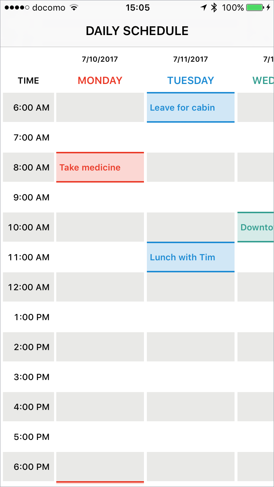
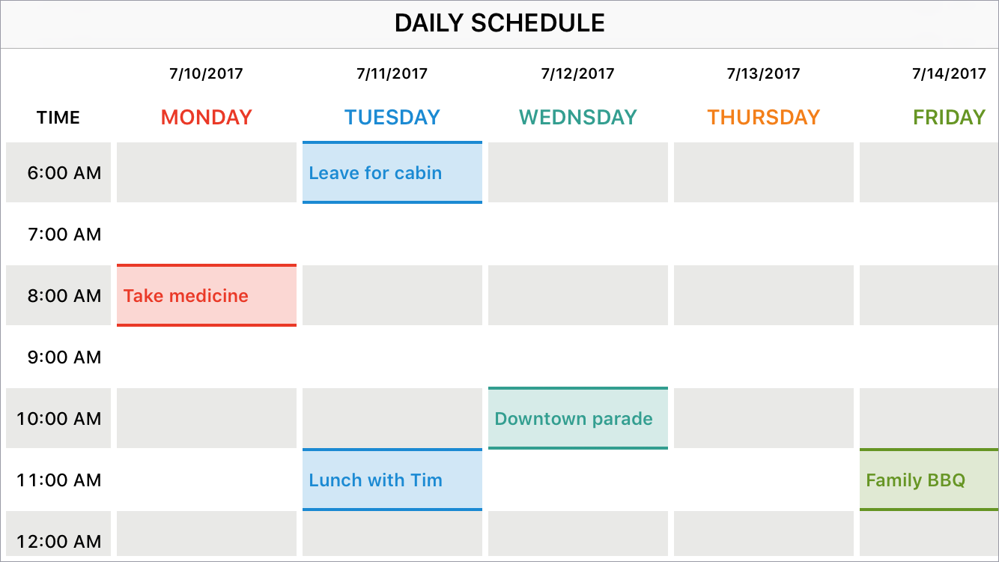
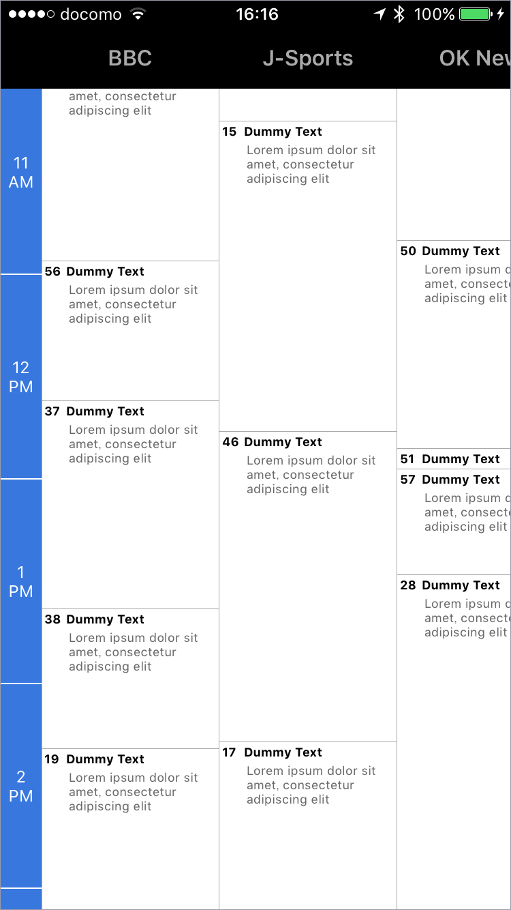
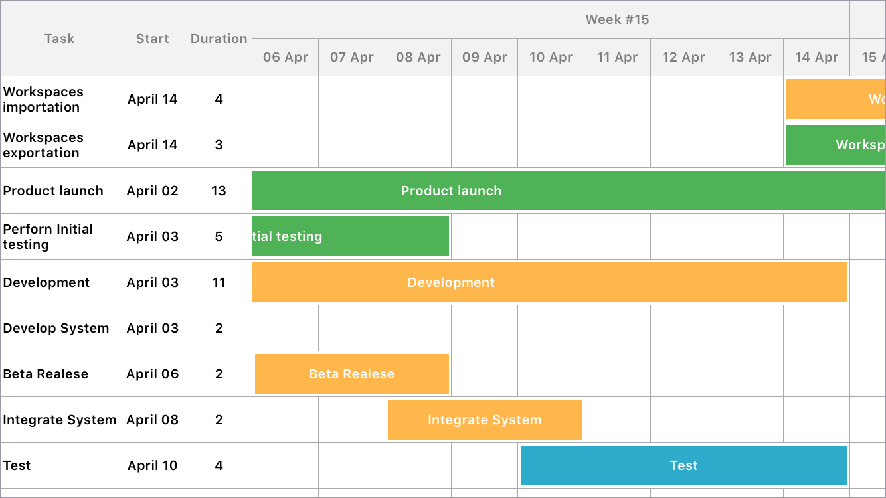

# SpreadsheetView Xamarin.iOS Binding

Full configurable spreadsheet view user interfaces for iOS applications. With this framework, you can easily create complex layouts like schedule, Gantt chart, timetable as if you are using Excel.

## Features

- [x] Fixed column and row headers
- [x] Merge cells
- [x] Circular infinite scrolling automatically
- [x] Customize gridlines and borders for each cell
- [x] Customize inter cell spacing vertically and horizontally
- [x] Fast scrolling, memory efficient
- [x] `UICollectionView` like API

> Find the above displayed 4 examples in the [`Examples`](/samples) folder.

## Native lib project

[ZMJGanttChart GitHub](https://github.com/keshiim/ZMJGanttChart)

> __N.B.__ Binding build only for iPhone builds. On Simulator it will fails to build.

## Preview

## TODO

- Add Collection wrapper for ReusableCollection
- Add Collection wrapper for ReusableQueue
- Include simulator arch slice for building on simulators 